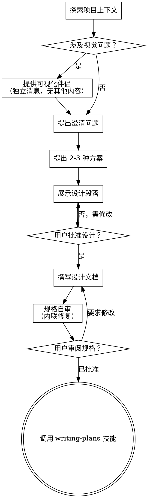

# 将创意头脑风暴为设计方案

通过自然的协作对话，帮助将创意转化为完整的设计和规格说明。

首先理解当前项目上下文，然后逐个提问来细化创意。一旦理解了要构建什么，就展示设计方案并获得用户批准。

<HARD-GATE>
在你展示设计方案且用户批准之前，不要调用任何实现技能、编写任何代码、搭建任何项目或采取任何实现行动。这适用于每个项目，无论看起来多简单。
</HARD-GATE>

## 反模式："这太简单了不需要设计"

每个项目都要经过这个流程。一个待办清单、一个单函数工具、一个配置变更——全部都要。"简单"的项目恰恰是未经审视的假设造成最多浪费工作的地方。设计可以很简短（对于真正简单的项目只需几句话），但你必须展示它并获得批准。

## 检查清单

你必须为以下每一项创建任务并按顺序完成：

1. **探索项目上下文** — 检查文件、文档、最近的提交
2. **提供可视化伴侣**（如果话题涉及视觉问题）— 这是一条独立的消息，不与澄清问题合并。参见下方的可视化伴侣部分。
3. **提出澄清问题** — 每次一个问题，理解目的/约束/成功标准
4. **提出 2-3 种方案** — 附带权衡分析和你的推荐
5. **展示设计** — 按与复杂度匹配的段落呈现，每个段落后获取用户批准
6. **撰写设计文档** — 保存到 `docs/superpowers/specs/YYYY-MM-DD-<topic>-design.md` 并提交
7. **规格自审** — 快速内联检查占位符、矛盾、歧义、范围（见下文）
8. **用户审阅书面规格** — 请用户在继续之前审阅规格文件
9. **过渡到实现** — 调用 writing-plans 技能创建实现计划

## 流程图

**最终状态是调用 writing-plans。** 不要调用 frontend-design、mcp-builder 或任何其他实现技能。头脑风暴后你唯一调用的技能是 writing-plans。

## 流程

**理解创意：**

- 首先查看当前项目状态（文件、文档、最近的提交）
- 在提出详细问题之前，评估范围：如果请求描述了多个独立子系统（例如，"构建一个包含聊天、文件存储、计费和分析的平台"），立即指出。不要在需要先分解的项目上花时间细化细节。
- 如果项目太大无法用单个规格描述，帮助用户分解为子项目：哪些是独立的部分、它们如何关联、应该以什么顺序构建？然后通过正常的设计流程头脑风暴第一个子项目。每个子项目有自己的规格 → 计划 → 实现周期。
- 对于范围合适的项目，逐个提问来细化创意
- 尽可能使用选择题，开放式问题也可以
- 每条消息只问一个问题——如果某个话题需要更多探索，拆分为多个问题
- 聚焦于理解：目的、约束、成功标准

**探索方案：**

- 提出 2-3 种不同的方案，附带权衡分析
- 以对话方式展示选项，给出你的推荐和理由
- 首先展示你推荐的选项并解释原因

**展示设计：**

- 一旦你认为理解了要构建什么，就展示设计
- 每个段落的详细程度与其复杂度匹配：如果直接了当就几句话，如果微妙就 200-300 字
- 每个段落后询问目前看起来是否正确
- 覆盖：架构、组件、数据流、错误处理、测试
- 准备好在某些地方不合理时回去澄清

**为隔离性和清晰性而设计：**

- 将系统分解为更小的单元，每个单元有单一明确的目的，通过定义良好的接口通信，并且可以独立理解和测试
- 对于每个单元，你应该能回答：它做什么、怎么使用它、它依赖什么？
- 别人能在不阅读其内部实现的情况下理解一个单元做什么吗？你能改变内部实现而不破坏使用者吗？如果不能，边界需要调整。
- 更小、边界良好的单元对你来说也更容易处理——你能更好地推理可以一次性放入上下文的代码，当文件聚焦时你的编辑也更可靠。当一个文件变得很大时，这通常是它做了太多事情的信号。

**在现有代码库中工作：**

- 在提出变更之前先探索当前结构。遵循现有模式。
- 当现有代码存在影响当前工作的问题时（例如，文件变得太大、边界不清晰、职责纠缠），在设计中包含有针对性的改进——就像优秀的开发者会改进他们正在工作的代码一样。
- 不要提出无关的重构。保持专注于服务于当前目标的内容。

## 设计之后

**文档：**

- 将验证过的设计（规格）写入 `docs/superpowers/specs/YYYY-MM-DD-<topic>-design.md`
  - （用户对规格位置的偏好覆盖此默认值）
- 如果可用，使用 elements-of-style:writing-clearly-and-concisely 技能
- 将设计文档提交到 git

**规格自审：**
写完规格文档后，以全新的视角审视它：

1. **占位符扫描：** 是否有 "TBD"、"TODO"、不完整的段落或模糊的需求？修复它们。
2. **内部一致性：** 是否有段落互相矛盾？架构是否与功能描述匹配？
3. **范围检查：** 这是否足够聚焦于单个实现计划，还是需要分解？
4. **歧义检查：** 是否有需求可以被两种不同方式解读？如果有，选择一种并明确说明。

内联修复任何问题。不需要重新审阅——修复后继续。

**用户审阅关卡：**
规格审阅循环通过后，请用户在继续之前审阅书面规格：

> "规格已写入并提交到 `<path>`。请审阅并告诉我你是否想在开始编写实现计划之前做任何修改。"

等待用户的回复。如果他们要求修改，进行修改并重新运行规格审阅循环。只有在用户批准后才继续。

**实现：**

- 调用 writing-plans 技能创建详细的实现计划
- 不要调用任何其他技能。writing-plans 是下一步。

## 关键原则

- **每次一个问题** - 不要用多个问题让人应接不暇
- **优先选择题** - 在可能的情况下比开放式问题更容易回答
- **无情地 YAGNI** - 从所有设计中移除不必要的功能
- **探索替代方案** - 在确定之前始终提出 2-3 种方案
- **增量验证** - 展示设计，在继续之前获得批准
- **保持灵活** - 当某些地方不合理时回去澄清

## 可视化伴侣

一个基于浏览器的伴侣，用于在头脑风暴期间展示模型、图表和视觉选项。作为工具可用——不是一种模式。接受伴侣意味着它可用于受益于视觉处理的问题；这并不意味着每个问题都通过浏览器处理。

**提供伴侣：** 当你预期即将到来的问题将涉及视觉内容（模型、布局、图表）时，一次性提供以征求同意：
> "我们正在处理的一些内容如果能通过网页浏览器展示给你，可能更容易解释。我可以在过程中制作模型、图表、对比和其他视觉内容。此功能仍较新且可能消耗较多 token。要试试吗？（需要打开本地 URL）"

**此提议必须是独立的消息。** 不要将其与澄清问题、上下文摘要或任何其他内容合并。该消息应仅包含上述提议，没有其他内容。在继续之前等待用户的回复。如果他们拒绝，继续纯文本头脑风暴。

**逐问题决策：** 即使用户接受了，也要为每个问题单独决定是使用浏览器还是终端。判断标准：**用户看到它是否比读到它更容易理解？**

- **使用浏览器**处理本身是视觉性的内容——模型、线框图、布局对比、架构图、并排的视觉设计
- **使用终端**处理文本性的内容——需求问题、概念性选择、权衡列表、A/B/C/D 文本选项、范围决策

一个关于 UI 话题的问题不自动是视觉问题。"在这个上下文中个性化意味着什么？"是一个概念问题——使用终端。"哪种向导布局更好？"是一个视觉问题——使用浏览器。

如果他们同意使用伴侣，在继续之前阅读详细指南：
`skills/brainstorming/visual-companion.md`
