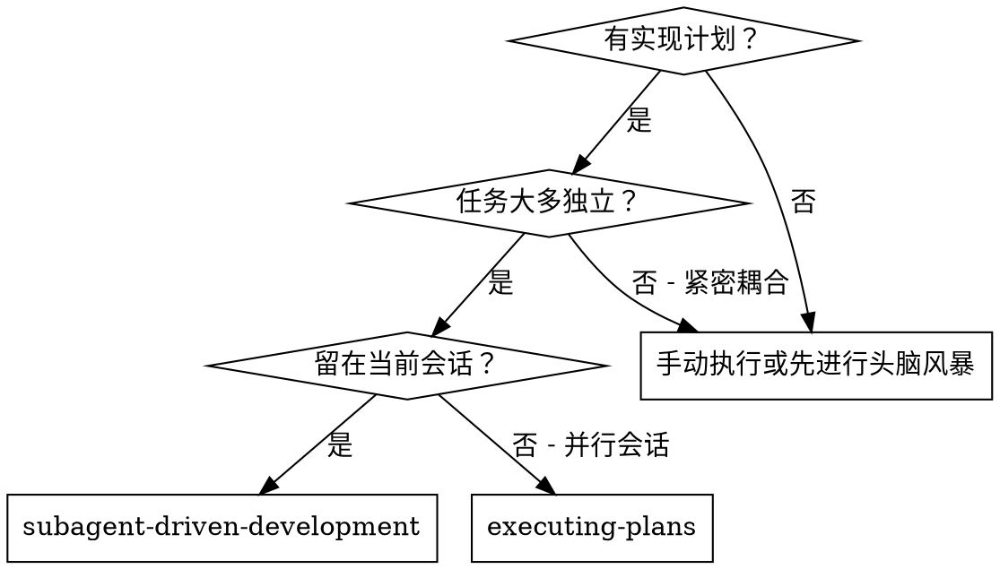
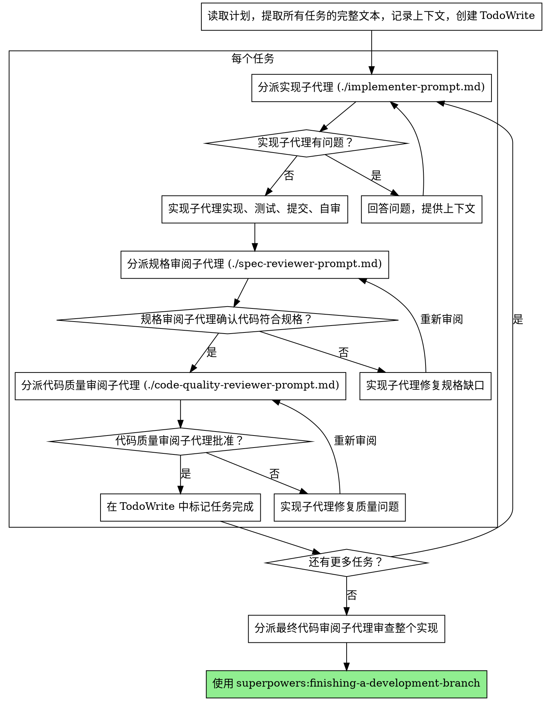

# 子代理驱动开发

通过为每个任务分派新的子代理来执行计划，每个任务完成后进行两阶段审阅：先审阅规格合规性，再审阅代码质量。

**为什么使用子代理：** 你将任务委托给具有隔离上下文的专业代理。通过精确构建它们的指令和上下文，确保它们保持专注并成功完成任务。它们不应继承你会话的上下文或历史——你精确构建它们需要的内容。这也为你自己的协调工作保留了上下文。

**核心原则：** 每个任务一个新子代理 + 两阶段审阅（先规格后质量）= 高质量、快速迭代

## 何时使用



**与执行计划（并行会话）对比：**
- 同一会话（无上下文切换）
- 每个任务一个新子代理（无上下文污染）
- 每个任务后两阶段审阅：先规格合规性，再代码质量
- 更快的迭代（任务间不需要人在循环中）

## 流程



## 模型选择

使用能处理每个角色的最低能力模型，以节省成本并提高速度。

**机械性实现任务**（隔离函数、清晰规格、1-2 个文件）：使用快速、便宜的模型。当计划详细规范时，大多数实现任务都是机械性的。

**集成和判断任务**（多文件协调、模式匹配、调试）：使用标准模型。

**架构、设计和审阅任务**：使用最强大的可用模型。

**任务复杂度信号：**
- 触及 1-2 个文件且有完整规格 → 便宜模型
- 触及多个文件且涉及集成问题 → 标准模型
- 需要设计判断或广泛的代码库理解 → 最强模型

## 处理实现者状态

实现者子代理报告四种状态之一。分别适当处理：

**DONE：** 进入规格合规性审阅。

**DONE_WITH_CONCERNS：** 实现者完成了工作但标记了疑虑。在继续之前阅读这些疑虑。如果疑虑关于正确性或范围，在审阅前解决。如果是观察性备注（例如，"这个文件变得很大"），记录下来并继续审阅。

**NEEDS_CONTEXT：** 实现者需要未提供的信息。提供缺失的上下文并重新分派。

**BLOCKED：** 实现者无法完成任务。评估阻塞原因：
1. 如果是上下文问题，提供更多上下文并用相同模型重新分派
2. 如果任务需要更多推理能力，用更强的模型重新分派
3. 如果任务太大，拆分为更小的部分
4. 如果计划本身有误，上报给人类

**永远不要**忽略上报或在不做变更的情况下强制同一模型重试。如果实现者说它卡住了，说明有些东西需要改变。

## 提示模板

- `./implementer-prompt.md` - 分派实现子代理
- `./spec-reviewer-prompt.md` - 分派规格合规性审阅子代理
- `./code-quality-reviewer-prompt.md` - 分派代码质量审阅子代理

## 示例工作流

```
你：我正在使用子代理驱动开发来执行此计划。

[一次性读取计划文件：docs/superpowers/plans/feature-plan.md]
[提取全部 5 个任务的完整文本和上下文]
[创建包含所有任务的 TodoWrite]

任务 1：钩子安装脚本

[获取任务 1 的文本和上下文（已提取）]
[分派实现子代理，附带完整任务文本 + 上下文]

实现者："在开始之前——钩子应该安装在用户级还是系统级？"

你："用户级（~/.config/superpowers/hooks/）"

实现者："明白了。开始实现..."
[稍后] 实现者：
  - 实现了 install-hook 命令
  - 添加了测试，5/5 通过
  - 自审：发现遗漏了 --force 标志，已添加
  - 已提交

[分派规格合规性审阅者]
规格审阅者：✅ 规格合规 - 所有需求已满足，无多余内容

[获取 git SHA，分派代码质量审阅者]
代码审阅者：优点：良好的测试覆盖，代码整洁。问题：无。已批准。

[标记任务 1 完成]

任务 2：恢复模式

[获取任务 2 的文本和上下文（已提取）]
[分派实现子代理，附带完整任务文本 + 上下文]

实现者：[无问题，直接开始]
实现者：
  - 添加了 verify/repair 模式
  - 8/8 测试通过
  - 自审：一切正常
  - 已提交

[分派规格合规性审阅者]
规格审阅者：❌ 问题：
  - 缺失：进度报告（规格要求"每 100 项报告一次"）
  - 多余：添加了 --json 标志（未要求）

[实现者修复问题]
实现者：移除了 --json 标志，添加了进度报告

[规格审阅者再次审阅]
规格审阅者：✅ 现在规格合规了

[分派代码质量审阅者]
代码审阅者：优点：扎实。问题（重要）：魔术数字 (100)

[实现者修复]
实现者：提取了 PROGRESS_INTERVAL 常量

[代码审阅者再次审阅]
代码审阅者：✅ 已批准

[标记任务 2 完成]

...

[所有任务完成后]
[分派最终代码审阅者]
最终审阅者：所有需求已满足，可以合并

完成！
```

## 优势

**与手动执行对比：**
- 子代理自然遵循 TDD
- 每个任务全新上下文（无混淆）
- 并行安全（子代理互不干扰）
- 子代理可以提问（工作前和工作期间）

**与执行计划对比：**
- 同一会话（无交接）
- 持续进展（无等待）
- 自动审阅检查点

**效率提升：**
- 无文件读取开销（控制器提供完整文本）
- 控制器精确策划所需上下文
- 子代理预先获得完整信息
- 在工作开始前暴露问题（而非之后）

**质量关卡：**
- 自审在交接前捕获问题
- 两阶段审阅：规格合规性，然后代码质量
- 审阅循环确保修复确实有效
- 规格合规性防止过度构建或构建不足
- 代码质量确保实现质量良好

**成本：**
- 更多子代理调用（每个任务 1 个实现者 + 2 个审阅者）
- 控制器做更多准备工作（预先提取所有任务）
- 审阅循环增加迭代次数
- 但能早期发现问题（比事后调试成本更低）

## 红色警报

**永远不要：**
- 未经用户明确同意就在 main/master 分支上开始实现
- 跳过审阅（规格合规性或代码质量）
- 在问题未修复的情况下继续
- 并行分派多个实现子代理（会冲突）
- 让子代理读取计划文件（应提供完整文本）
- 跳过场景设定上下文（子代理需要理解任务的位置）
- 忽略子代理的问题（在让它们继续之前必须回答）
- 在规格合规性上接受"差不多"（规格审阅者发现了问题 = 未完成）
- 跳过审阅循环（审阅者发现问题 = 实现者修复 = 再次审阅）
- 让实现者的自审替代实际审阅（两者都需要）
- **在规格合规性 ✅ 之前开始代码质量审阅**（顺序错误）
- 在任一审阅有未解决问题的情况下进入下一个任务

**如果子代理提问：**
- 清晰完整地回答
- 如需提供额外上下文
- 不要催促它们进入实现

**如果审阅者发现问题：**
- 实现者（同一子代理）修复它们
- 审阅者再次审阅
- 重复直到批准
- 不要跳过重新审阅

**如果子代理任务失败：**
- 分派修复子代理并附带具体指令
- 不要尝试手动修复（上下文污染）

## 集成

**必需的工作流技能：**
- **superpowers:using-git-worktrees** - 必需：在开始前设置隔离工作空间
- **superpowers:writing-plans** - 创建此技能执行的计划
- **superpowers:requesting-code-review** - 审阅者子代理的代码审阅模板
- **superpowers:finishing-a-development-branch** - 所有任务完成后完成开发

**子代理应使用：**
- **superpowers:test-driven-development** - 子代理为每个任务遵循 TDD

**替代工作流：**
- **superpowers:executing-plans** - 用于并行会话而非同会话执行
